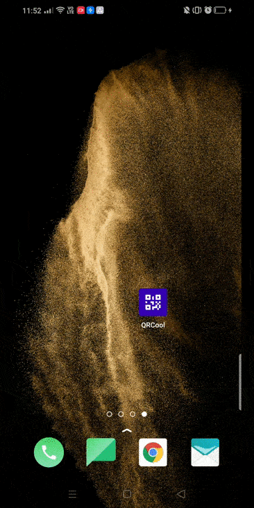

# QR Cool

**Goal**: Create an android application allowing to scan barcodes.

## Phone display

     

       

      

## Class diagram for database

    

## Requirements
* Computer (Windows, Mac or Linux)
* Android Studio

## Setup the project in Android studio
1. Download the project code, preferably using `git clone https://github.com/YannMancel/QRCool.git`.
2. In Android Studio, select *File* | *Open...*
3. Select the project
     
     
## Compile and execute the project in Android studio
1. In Android Studio, select *Run* | *Run...*
2. Choose `app` in *Run dialog*
3. Select a device (*Available Virtual Devices* or *Connected Devices*)
4. Select `OK` in *Select Deployment Target dialog*

## Wiki
* [Android Jetpack](https://developer.android.com/jetpack)
  * [Architecture Components](https://developer.android.com/topic/libraries/architecture/)
    * [LiveData](https://developer.android.com/topic/libraries/architecture/livedata)
    * [ViewModel](https://developer.android.com/topic/libraries/architecture/viewmodel)
    * [Navigation](https://developer.android.com/guide/navigation/)
    * [Room](https://developer.android.com/topic/libraries/architecture/room)
  * [Behavior CameraX](https://developer.android.com/training/camerax)
  * [KTX Extensions](https://developer.android.com/kotlin/ktx)
* [Library Material Components](https://github.com/material-components/material-components-android)
* [Library Coroutines](https://github.com/Kotlin/kotlinx.coroutines)
* [Library ML Kit - Barcode scanning](https://developers.google.com/ml-kit/vision/barcode-scanning/android)
* [Library Koin](https://github.com/InsertKoinIO/koin)

## Troubleshooting

### No device available during the compilation and execution steps 
* If none of device is present (*Available Virtual Devices* or *Connected Devices*),
    * Either select `Create a new virtual device`
    * or connect and select your phone or tablet
     
     
## Useful
* [Download Android Studio](https://developer.android.com/studio)
* [Create a new virtual device](https://developer.android.com/studio/run/managing-avds.html)
* [Enable developer options and debugging](https://developer.android.com/studio/debug/dev-options.html#enable)